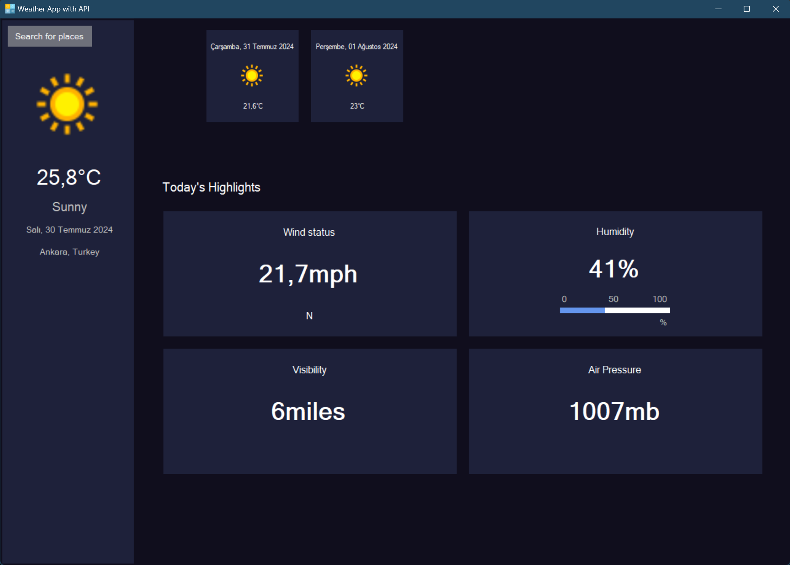

# Weather-App-with-API

## About

This project is a weather application developed using WinForms and an external API. It provides real-time weather information and forecasts based on user input, utilizing data fetched from a weather API.

## Screenshot


## Features

- **Real-Time Weather Data**: Fetch and display current weather information for any location.
- **Weather Forecast**: Show weather forecasts for the upcoming days.
- **User-Friendly Interface**: Easy-to-use interface for entering locations and viewing weather data.
- **API Integration**: Connects to a weather API to retrieve and display weather information.

## Technologies Used

- **C# WinForms**: Framework for building the desktop application interface.
- **Weather API**: API used to fetch weather data.
- **.NET Framework/Core**: Used for backend logic and operations.
- **Visual Studio**: Integrated development environment used for development.

## Installation

1. **Clone the Repository**:
    ```sh
    git clone https://github.com/BeratARPA/Weather-App-with-API.git
    ```
2. **Open with Visual Studio**: Open the project in Visual Studio.
3. **Install Dependencies**: Ensure all necessary dependencies are resolved.
4. **Configure API Key**: Set up your weather API key in the configuration file.
5. **Build the Project**: Build the solution to ensure proper setup.
6. **Run the Project**: Press F5 to run the project and access the weather application.

## Usage

1. **Launch the Application**: Start the application from Visual Studio or the executable.
2. **Enter Location**: Input a location to retrieve current weather information.
3. **View Weather Data**: Check the displayed weather data and forecasts.
4. **Check Logs**: View logs for any errors or issues with data retrieval.

## Contributing

If you would like to contribute, please fork the repository, create a feature branch, and submit a pull request.

## License

This project is licensed under the MIT License. See the [LICENSE](LICENSE) file for more details.

## Contact

For questions or feedback, feel free to contact me:
- **Email**: [beratarpa@hotmail.com](mailto:beratarpa@hotmail.com)
- **GitHub**: [https://github.com/BeratARPA](https://github.com/BeratARPA)
